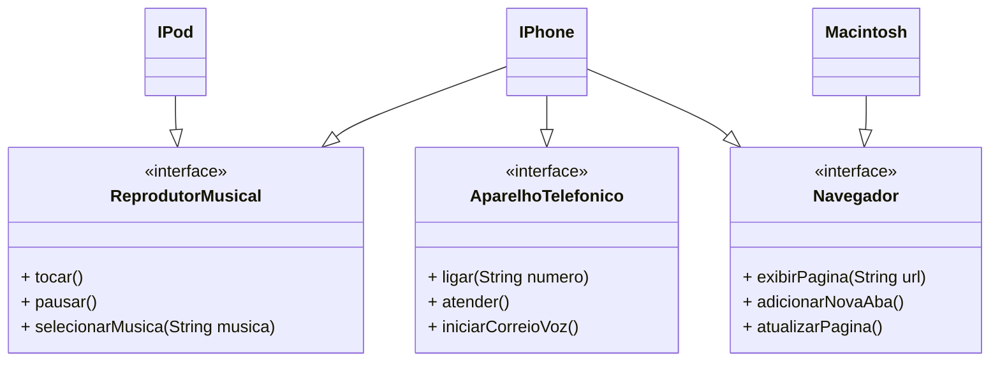

# POO - Desafio

## Modelagem e Diagramação de um Componente iPhone

### Diagrama UML

### Modelagem

- [Produtos](https://github.com/gabriellabueno/java-backend-bootcamp/tree/main/src/poo/desafio/produtos)  
- [Utilitários](https://github.com/gabriellabueno/java-backend-bootcamp/tree/main/src/poo/desafio/utilitarios)  
- [Apple](Apple.java)  